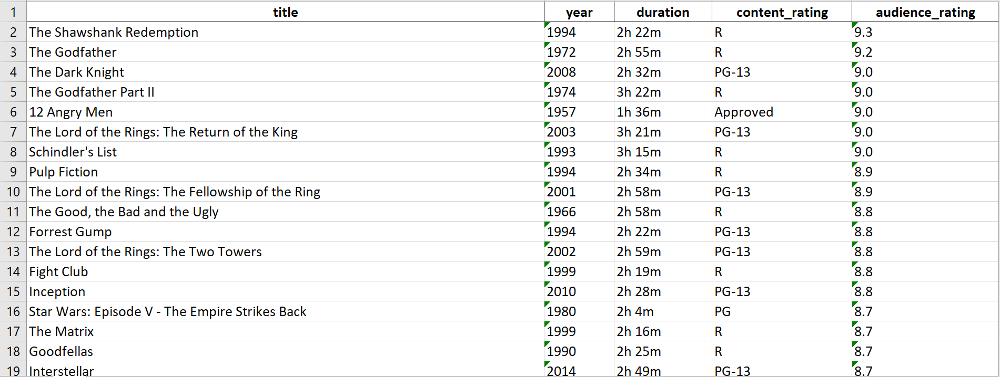

# IMDb Top Movies Scraper

This Python script uses Selenium and BeautifulSoup to scrape the top 100 movies on IMDb. The program extracts movie data such as title, release year, rating, and IMDb link, and saves the results in both Excel and JSON formats.

## Features

- **Scrapes IMDb Top 100 Movies**: The script navigates to the IMDb Top 250 movies page and extracts information on the top 100 movies.
- **Extracts Data**: Includes movie title, release year, IMDb rating, and IMDb link.
- **Outputs to Excel and JSON**: Saves the scraped data to an Excel file (`.xlsx`) and a JSON file (`.json`).

## Preview

Here’s a preview of the Excel output generated by the scraper:



## Requirements

- Python 3.x
- Selenium
- WebDriver Manager
- OpenPyXL
- Pandas

```
You can install the necessary libraries using `pip`:

bash
pip install selenium webdriver-manager openpyxl pandas
```

## Setup

- Install ChromeDriver: This script automatically installs the latest version of ChromeDriver using webdriver-manager.
- Running the Script: Once all dependencies are installed, you can run the script as follows: python youtubeTrending.py

## Outputs

- Excel File: The data is saved in an Excel file named IMDb Top Movies.xlsx.
- JSON File: The data is also saved in a JSON file named IMDb Top Movies.json.

## How It Works

- Setup WebDriver: Configures the Chrome WebDriver with options.
- Navigate to IMDb Top 250 Page: Visits IMDb's Top 250 movies page.
- Extract Movie Information: Extracts data like movie title, release year, IMDb rating, and IMDb link.
- Save Data: Saves the extracted data into both Excel and JSON files.
- Print Data: Prints the extracted video details to the console.

## Example Output in Json

    "title": "The Shawshank Redemption",
    "year": "1994",
    "duration": "2h 22m",
    "content_rating": "R",
    "audience_rating": "9.3"
    ----------------------------------------------------------------------------------------------
